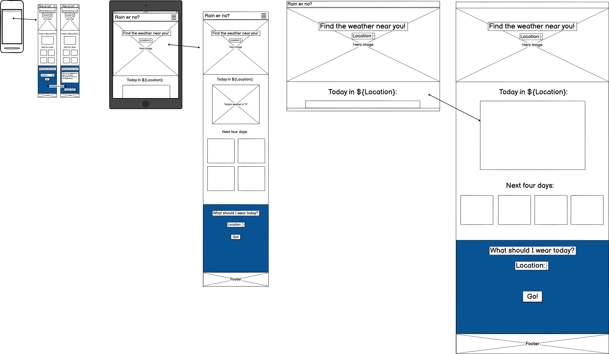

## Rain-or-No?

## User Stories

**The Must Haves**

 **As a user, I want the website to be visually appealing and easy to navigate, so that I can quickly find the information I need.**
   - **Acceptance Criteria:**
     - The website has a clean and modern design.
     - The website has a clear layout with distinct sections for current weather and forecast.
   - **Tasks:**
     - Design the website layout with distinct sections for current weather and forecast.
     - Apply CSS styles to create a clean and modern design.
     - Ensure the website is easy to navigate.

**As a user, I want to see the current weather for my location, so that I can know the current weather conditions.**
   - **Acceptance Criteria:**
     - The website displays the current temperature for the user's location.
     - The website displays the current weather conditions (e.g., sunny, cloudy, rainy).
   - **Tasks:**
     - Set up the HTML structure for displaying current weather.
     - Fetch current weather data from a weather API.
     - Display the fetched temperature and weather conditions on the website.

 **As a user, I want to see weather information such as temperature, weather conditions, and humidity, so that I have a comprehensive understanding of the weather.**
   - **Acceptance Criteria:**
     - The website displays the current temperature, weather conditions, and humidity.
     - The website displays the forecasted temperature, weather conditions, and humidity for the next 4 days.
   - **Tasks:**
     - Fetch and display current temperature, weather conditions, and humidity.
     - Fetch and display forecasted temperature, weather conditions, and humidity for the next 4 days.

 **As a user, I want to see a 4-day weather forecast for my location, so that I can plan my activities accordingly.**
   - **Acceptance Criteria:**
     - The website displays the temperature forecast for the next 4 days.
     - The website displays the weather conditions for the next 4 days.
   - **Tasks:**
     - Set up the HTML structure for displaying the 4-day forecast.
     - Fetch 4-day weather forecast data from a weather API.
     - Display the fetched temperature and weather conditions for the next 4 days on the website.

 **As a user, I want the website to load quickly and display accurate information, so that I can rely on it for my weather updates.**
   - **Acceptance Criteria:**
     - The website loads within 3 seconds.
     - The weather data displayed is accurate and up-to-date.
   - **Tasks:**
     - Optimize the website for fast loading times.
     - Ensure the weather data fetched from the API is accurate and up-to-date.

 **As a user, I want the website to be responsive and work well on both desktop and mobile devices, so that I can access it from anywhere.**
   - **Acceptance Criteria:**
     - The website is fully responsive and adjusts to different screen sizes.
     - The website is functional and easy to use on both desktop and mobile devices.
   - **Tasks:**
     - Implement responsive design using CSS media queries.
     - Test the website on different devices to ensure functionality and ease of use.

**It would be good it it could:**

 **As a user, I want the website to automatically detect my location, so that I don't have to manually enter it.**
   - **Acceptance Criteria:**
     - The website uses geolocation to detect the user's location.
     - The website fetches and displays weather data based on the detected location.
   - **Tasks:**
     - Implement geolocation to detect the user's location.
     - Use the detected location to fetch weather data from a weather API.
     - Display the fetched weather data based on the detected location.
 

# The WireFrame for the look of the website

Simple layout with easy to input location and a todays weather and a 4 day forecast mainly for Cornish users hence the Name chosen as Rain-or-no?

# The back ground image is used to give a cornish vibe

